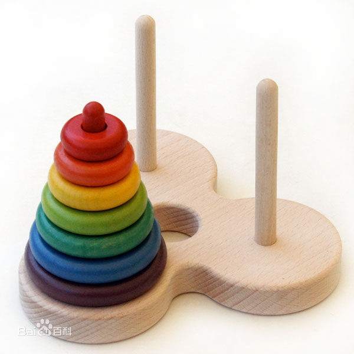

### 12-汉诺塔问题

---
关于汉诺塔：

> 汉诺塔：汉诺塔（又称河内塔）问题是源于印度一个古老传说的益智玩具。大梵天创造世界的时候做了三根金刚石柱子，在一根柱子上从下往上按照大小顺序摞着64片黄金圆盘。大梵天命令婆罗门把圆盘从下面开始按大小顺序重新摆放在另一根柱子上。并且规定，在小圆盘上不能放大圆盘，在三根柱子之间一次只能移动一个圆盘。



---

思路：

1. 递归解决：把问题转化为规模缩小了的同类问题的子问题；
2. 明确递归结束的条件(base case)：n == 1
3. 其他过程：from：来源地；to：目的地；help：辅助。

---

参考答案：

```js
function hanoiProcess(n,from,to,help){
	if (n < 1) {
		return;
	}
	if (n == 1) {  // 最后一个从from移到to
		console.log("Move 1 from " + from + " to " + to);
	} else{
		hanoiProcess(n-1, from, help, to);  // 前n-1个从from移到help上，可以借助to
		console.log("Move "+ n +" from " + from + " to " + to);
		hanoiProcess(n-1, help, to, from);  // 再把n-1个从help移到to，可以借助from
	}
}
hanoiProcess(3, "左", "右", "中");
// Move 1 from 左 to 右
// Move 2 from 左 to 中
// Move 1 from 右 to 中
// Move 3 from 左 to 右
// Move 1 from 中 to 左
// Move 2 from 中 to 右
// Move 1 from 左 to 右
```