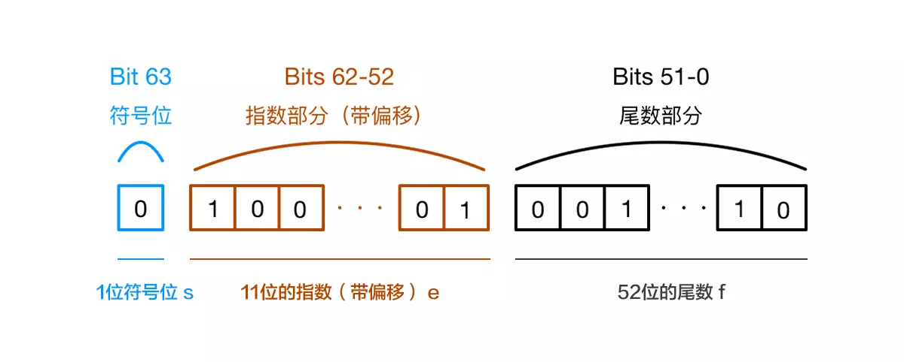

## IEEE-754 精度问题

### 为什么 `0.1 + 0.2 !== 0.3` ?

所有使用 IEEE-754 数字实现的编程语言都有这个问题。

#### 先看看 JavaScript 是如何表示数字的？

JavaScript 使用 Number 类型表示数字（整数和浮点数），遵循 IEEE 754 标准 通过 64 位来表示一个数字

通过图片具体看一下数字在内存中的表示:



**科普一个小知识点**：js 最大安全数是 `Number.MAX_SAFE_INTEGER == Math.pow(2,53) - 1`, 而不是 `Math.pow(2,52) - 1`, why？尾数部分不是只有 52 位吗?

> 这是因为二进制表示有效数字总是 1.xx…xx 的形式，尾数部分 f 在规约形式下第一位默认为 1（省略不写，xx..xx 为尾数部分 f，最长 52 位）。因此，JavaScript 提供的有效数字最长为 53 个二进制位（64 位浮点的后 52 位+被省略的 1 位）

#### 0.1 与 0.2 的二进制表现

0.1 和 0.2 的二进制浮点数表示并不是精确的，所以相加后不等于 0.3。这个相加的结果接近 0.30000000000000004。

首先将 0.1 转化为 2 进制

```js
// 0.1  十进制 -> 二进制
0.1 * 2 = 0.2  取0
0.2 * 2 = 0.4  取0
0.4 * 2 = 0.8  取0
0.8 * 2 = 1.6  取1
0.6 * 2 = 1.2  取1
0.2 * 2 = 0.4  取0
0.4 * 2 = 0.8  取0
0.8 * 2 = 1.6  取1
0.6 * 2 = 1.2  取1
//0.000110011(0011)`   0.1二进制(0011)里面的数字表示循环

```

你会发现 0.1 转二级制会一直无线循环下去，根本算不出一个正确的二进制数。

所以我们得出 0.1 = 0.000110011(0011)，那么 0.2 的演算也基本如上所示，所以得出 0.2 = 0.00110011(0011)

六十四位中符号位占一位，整数位占十一位，其余五十二位都为小数位。因为 0.1 和 0.2 都是无限循环的二进制了，所以在小数位末尾处需要判断是否进位（就和十进制的四舍五入一样）

那么把这两个二进制加起来会得出 0.010011....0100 , 这个值算成十进制就是 0.30000000000000004

---
