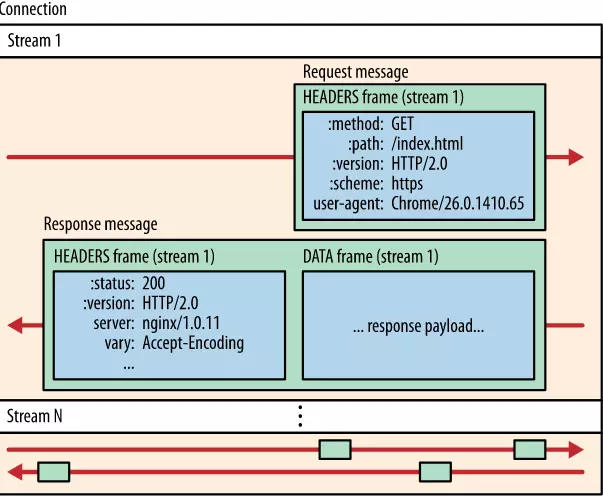
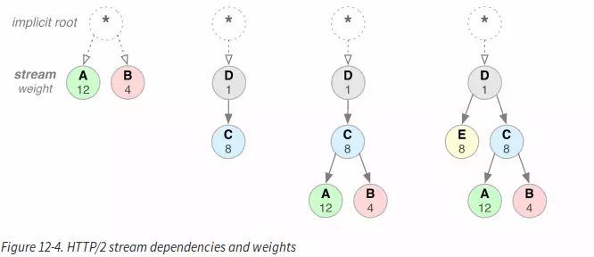
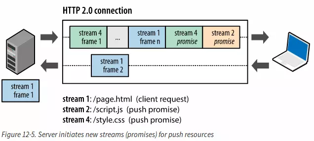
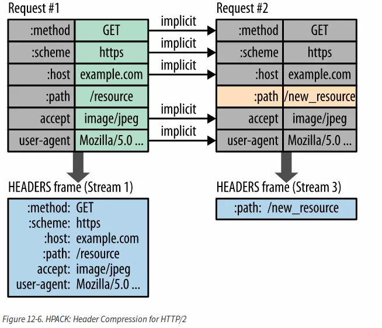

## HTTP2 与 HTTP1.1 的区别

HTTP/2 是 HTTP 协议自 1999 年 HTTP 1.1 发布后的首个更新，主要基于 SPDY 协议。  
由互联网工程任务组（IETF）的 Hypertext Transfer Protocol Bis（httpbis）工作小组进行开发。  
该组织于 2014 年 12 月将 HTTP/2 标准提议递交至 IESG 进行讨论，于 2015 年 2 月 17 日被批准。  
HTTP/2 标准于 2015 年 5 月以 RFC 7540 正式发表。

### HTTP/2 带来了什么好处?

> HTTP/2 enables a more efficient use of network resources and a reduced perception of latency by introducing header field compression and allowing multiple concurrent exchanges on the same connection… Specifically, it allows interleaving of request and response messages on the same connection and uses an efficient coding for HTTP header fields. It also allows prioritization of requests, letting more important requests complete more quickly, further improving performance.
> The resulting protocol is more friendly to the network, because fewer TCP connections can be used in comparison to HTTP/1.x. This means less competition with other flows, and longer-lived connections, which in turn leads to better utilization of available network capacity. Finally, HTTP/2 also enables more efficient processing of messages through use of binary message framing.

简单来说,HTTP/2 更强大,高效。它通过 **压缩头部域和响应多路复用** 来更有效的利用网络资源和降低延迟。它还添加了**请求优先级**,让更重要的请求更快地完成,从而进一步提高性能。
还增加了**服务器推送**,支持这些特性需要大量的协议增加头部字段来支持,例如新的流量控制,差错处理,升级机制.HTTP/2 并没有在应用中改变 HTTP 的语义,它通过在新的二进制帧层控制整个过程以及隐藏复杂性,而这不需要改变原来有的东西就可以实现.

下面我们来介绍下这几个新特性。

### 二进制帧层

性能提升的核心在于二进制帧层.它指 HTTP 消息在客户端和服务端如何封装和传输。

它在 socket 接口之间采用一种更好的编码机制,与 HTTP1.x 的采用的换行符分隔文本不同，HTTP/2 消息被分成很小的消息和 frame,然后每个消息和 frame 用二进制编码。客户端和服务端都采用二进制编码和解码。HTTP/1.x 的客户端不能与只有 HTTP/2 的服务端通信。幸运的是，我们的应用还没意识到这些改变。客户端和服务端能够很好的处理这些帧。

接下来我们来看看通过二进制帧机制,数据是如何在客户端和服务端交换的。

#### 帧,流和消息

**帧:** HTTP/2 通信的最小单元。每个桢包括一个帧头，里面有个很小标志，来区别是属于哪个流。

**流:** 存在于连接中的一个虚拟通道。流可以承载双向消息，每个流都有一个唯一的整数 ID。

**消息:** 一个完整的帧序列,由一个或多个帧组成。

**HTTP/2 中，同域名下所有通信都在单个连接上完成，该连接可以承载任意数量的双向数据流。**

每个数据流都以消息的形式发送，而消息又由一个或多个帧组成。多个帧之间可以乱序发送，根据帧首部的流标识可以重新组装。

### 多路复用

在 HTTP/1.x 中,用户想要多个并行的请求来提高性能,但是这样必须得使用多个 TCP 连接.这样的操作是属于 HTTP/1.x 发送模型的直接序列.它能保证在每次连接中在一个时间点只有一个响应被发送出去.更糟糕的是,它使得队头阻塞和重要 TCP 连接的低效使用.

在 HTTP/2 中,新的二进制帧层,解除了这个限制.使得所有的请求和响应多路复用.通过允许客户端和服务端把 HTTP 消息分解成独立的帧,交错传输,然后在另一端根据帧首部的流标识重新组装.

图 12-3 显示了在一次连接中的多个流.客户端传输数据帧到服务端(Stream5).服务端传输交错的帧序列(Stream1,Stream3)到客户端.此时,同时存在并行的 3 个流.

能够把 HTTP 消息分解成交错的帧,并在另一端组装。它们是 HTTP/2 中一个非常重要的提高.它有以下作用:

1. 交错的多个并行的请求或者,而不需要阻塞.

2. 使用一个连接传递所有的并行的请求和响应.

3. 移除了 HTTP/1.x 中没有的必要的解决方法.例如级联文件,域分片.

4. 淘汰没必要的潜在因素来降低页面载入的时间.提升可用网络容积的使用率.

**新的二进制帧层解决了 HTTP/1.X 中头部阻塞的问题.在并行处理和传输的请求和响应不再需要多个连接.这使得我们的应用更简单,快捷和便宜.**

HTTP/2.0 的连接是持久的,每个源仅仅需要一个连接.大部分 HTTP 的传输是短的,并且突然的.

然而 TCP 连接却适合长期存活的,批量的数据传输.通过利用相同的 HTTP/2 连接,既能够充分利用 TCP 连接,也能减小整体协议的头部.

更进一步来说,更少的连接内存的占用以及全连接路径的处理过程.向 HTTP/2 的转移不仅减少了网络潜在因素,更减少了操作代价.

**减少连接,同时也提高了 HTTPS 的性能,因为仅需要更少的 TLS 层的握手.**

### 请求优先级

为了能方便流的传输顺序,HTTP/2.0 提出,使每个流都有一个权重和依赖.

- 每个流的权重值在 1~256 之间

- 每个流可以详细给出对其他流的依赖

流权重和依赖的结合使客户端可以构造和通信一个优先级二叉树来表达它更想得到哪种响应.然后服务端可以按权重分配硬件资源(CPU,内存).

在 HTTP/2 ,一个流的依赖可以显式用其他流的标志来表达,如果省略了标志,则说明它的依赖是根流.一般来说,父流应该在它的依赖流之前分配资源,例如 D 应该是 C 之前被发送.依赖于同一父节点的应该按照他们的权重分配资源.例如 A 结点的权重为 12,它的兄弟结点 B 的结点的权重为 4.然后按比例分资源,A 占 12/16,B 占 4/16.如上面所述,流的依赖和权重提供了一种很好的表达式语言来表达资源的优先级.但是我们应该明白,,流的依赖和权重只是提供了一种传输偏好,而不是说一定是这样的比例.

### 服务端推送

Server Push 这个特性是让服务端将部分资源主动推送给客户端（浏览器），节约了客户端需要使用这些资源再次发送请求所消耗的时间。

服务端可以主动推送，客户端也有权利选择是否接收。如果服务端推送的资源已经被浏览器缓存过，浏览器可以通过发送 RST_STREAM 帧来拒收。每个推送的资源都是一个流，与内联资源不同，它允许客户端对其进行单独复用，优先化和处理。主动推送也遵守同源策略，服务器不会随便推送第三方资源给客户端。

### 头部压缩

HTTP 1.1 请求的大小变得越来越大，有时甚至会大于 TCP 窗口的初始大小，因为它们需要等待带着 ACK 的响应回来以后才能继续被发送。

HTTP/2 对消息头采用 [HPACK](https://imququ.com/post/header-compression-in-http2.html)（专为 http/2 头部设计的压缩格式）进行压缩传输，能够节省消息头占用的网络的流量。而 HTTP/1.x 每次请求，都会携带大量冗余头信息，浪费了很多带宽资源。

- 它允许通过静态霍夫曼编码对传输的头部字段进行编码，从而减少它们各自的传输大小。

- 它要求客户端和服务器都维护和更新先前看到的标题字段的索引列表（即，建立共享压缩上下文），然后将其用作参考以高效编码先前传输的值。

霍夫曼编码允许单个值在传输时被压缩，并且先前传输值的索引列表允许我们通过传输索引值来编码重复值，索引值可用于有效地查找和重建完整头部键和值。

### 流量控制

HTTP2.0 为数据流和连接的流量提供了一个简单的机制：

- 流量基于 HTTP 链接的每一跳进行，而非端到端的控制

- 流量控制基于窗口更新帧进行，即接收方广播自己准备接收某个数据流的多少字节，以及对整个链接要接收多少个字节。

- 流量控制有方向性，即接收方可能根据自己的情况为没个流乃至整个链接设置任意窗口大小

- 流量控制可以由接收方禁用，包括针对个别的流和针对整个链接。

- 帧的类型决定了流量控制是否适用于帧，目前只有 DATA 帧服从流量控制，所有其他类型的帧并不会消耗流量控制窗口的空间。这保证了重要的控制帧不会被流量控制阻塞

## 参考文献

[HTTP/2 新特性总结](https://www.jianshu.com/p/67c541a421f9)
