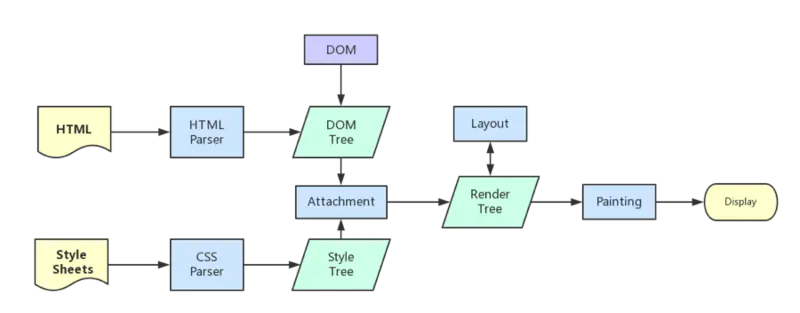

## 浏览器线程与进程

### 基本概念

进程（process）和线程（thread）是操作系统的基本概念

**线程** 是 cpu 调度的一个基本单位，一个 cpu 同时只能执行一个线程的任务，同样一个线程任务也只能在一个 cpu 上执行，所以如果你运行 Node.js 的机器是像 i5，i7 这样多核 cpu，那么将无法充分利用多核 cpu 的性能来为 Node.js 服务。

**进程** 本质上就是一个程序在一个数据集上的动态执行过程. 进程通常由程序, 数据集和进程控制块三部分组成.

**进程是 CPU 资源分配的最小单位（是能拥有资源和独立运行的最小单位）。**

**线程是 CPU 调度的最小单位（是建立在进程基础上的一次程序运行单位）。**

现代操作系统都是可以同时运行多个任务的,比如:用浏览器上网的同时还可以听音乐。

对于操作系统来说,一个任务就是一个进程,比如打开一个浏览器就是启动了一个浏览器进程,打开一个 Word 就启动了一个 Word 进程。

有些进程同时不止做一件事,比如 Word,它同时可以进行打字、拼写检查、打印等事情。在一个进程内部,要同时做多件事,就需要同时运行多个“子任务”,我们把进程内的这些“子任务”称为线程。

由于每个进程至少要做一件事,所以一个进程至少有一个线程。系统会给每个进程分配独立的内存,因此进程有它独立的资源。同一进程内的各个线程之间共享该进程的内存空间（包括代码段,数据集,堆等）。

借用一个生动的比喻来说,进程就像是一个有边界的生产厂间,而线程就像是厂间内的一个个员工,可以自己做自己的事情,也可以相互配合做同一件事情。

当我们启动一个应用,计算机会创建一个进程,操作系统会为进程分配一部分内存,应用的所有状态都会保存在这块内存中。

应用也许还会创建多个线程来辅助工作,这些线程可以共享这部分内存中的数据。如果应用关闭,进程会被终结,操作系统会释放相关内存。

### 浏览器的多进程架构

一个好的程序常常被划分为几个相互独立又彼此配合的模块,浏览器也是如此。

以 Chrome 为例,它由多个进程组成,每个进程都有自己核心的职责,它们相互配合完成浏览器的整体功能,每个进程中又包含多个线程,一个进程内的多个线程也会协同工作,配合完成所在进程的职责。

Chrome 采用多进程架构,其顶层存在一个 Browser process 用以协调浏览器的其它进程。

#### 优点

- 由于默认新开 一个 tab 页面 新建 一个进程,所以单个 tab 页面崩溃不会影响到整个浏览器。
- 同样,第三方插件崩溃也不会影响到整个浏览器。
- 多进程可以充分利用现代 CPU 多核的优势。
- 方便使用沙盒模型隔离插件等进程,提高浏览器的稳定性。

#### 缺点

系统为浏览器新开的进程分配内存、CPU 等资源,所以内存和 CPU 的资源消耗也会更大。
不过 Chrome 在内存释放方面做的不错,基本内存都是能很快释放掉给其他程序运行的。

### 浏览器的主要进程和职责

- 主进程 Browser Process —— 负责浏览器界面的显示与交互。各个页面的管理,创建和销毁其他进程。网络的资源管理、下载等。

- 第三方插件进程 Plugin Process —— 每种类型的插件对应一个进程,仅当使用该插件时才创建。

- GPU 进程 GPU Process —— 最多只有一个,用于 3D 绘制等

- 渲染进程 Renderer Process 称为浏览器渲染进程或浏览器内核,内部是多线程的。主要负责页面渲染,脚本执行,事件处理等

**其中渲染进程又有以下线程：**

1. GUI 渲染线程

   负责渲染浏览器界面,解析 HTML,CSS,构建 DOM 树和 RenderObject 树,布局和绘制等。

   当界面需要重绘（Repaint）或由于某种操作引发回流(reflow)时,该线程就会执行。

   注意,GUI 渲染线程与 JS 引擎线程是互斥的,当 JS 引擎执行时 GUI 线程会被挂起（相当于被冻结了）,GUI 更新会被保存在一个队列中等到 JS 引擎空闲时立即被执行。

2. JS 引擎线程

   Javascript 引擎,也称为 JS 内核,负责处理 Javascript 脚本程序。（例如 V8 引擎）

   JS 引擎线程负责解析 Javascript 脚本,运行代码。

   JS 引擎一直等待着任务队列中任务的到来,然后加以处理,一个 Tab 页（renderer 进程）中无论什么时候都只有一个 JS 线程在运行 JS 程序。

   注意,GUI 渲染线程与 JS 引擎线程是互斥的,所以如果 JS 执行的时间过长,这样就会造成页面的渲染不连贯,导致页面渲染加载阻塞。

3. 事件触发线程

   归属于浏览器而不是 JS 引擎,用来控制事件循环（可以理解,JS 引擎自己都忙不过来,需要浏览器另开线程协助）

   当 JS 引擎执行代码块如 **鼠标点击** 时会将对应任务添加到事件线程中

   当对应的事件符合触发条件被触发时,该线程会把事件添加到待处理队列的队尾,等待 JS 引擎的处理

   注意,由于 JS 的单线程关系,所以这些待处理队列中的事件都得排队等待 JS 引擎处理（当 JS 引擎空闲时才会去执行）

4. 定时触发器线程

   传说中的 setInterval 与 setTimeout 所在线程

   浏览器定时计数器并不是由 JavaScript 引擎计数的,（因为 JavaScript 引擎是单线程的, 如果处于阻塞线程状态就会影响记计时的准确）

   因此通过单独线程来计时并触发定时（计时完毕后,添加到事件队列中,等待 JS 引擎空闲后执行）

   注意,W3C 在 HTML 标准中规定,规定要求 setTimeout 中低于 4ms 的时间间隔算为 4ms。

5. 异步 http 请求线程

   在 XMLHttpRequest 在连接后是通过浏览器新开一个线程请求。

   将检测到状态变更时,如果设置有回调函数,异步线程就产生状态变更事件,将这个回调再放入事件队列中。再由 JavaScript 引擎执行。

### 浏览器渲染流程

- 解析 HTML 文件,构建 DOM 树,同时浏览器主进程负责下载 CSS 文件
- CSS 文件下载完成,解析 CSS 文件成树形的数据结构,然后结合 DOM 树合并成 RenderObject 树
- 布局 RenderObject 树 （Layout/reflow）,负责 RenderObject 树中的元素的尺寸,位置等计算
- 绘制 RenderObject 树 （paint）,绘制页面的像素信息
- 浏览器主进程将默认的图层和复合图层交给 GPU 进程,GPU 进程再将各个图层合成（composite）,最后显示出页面
