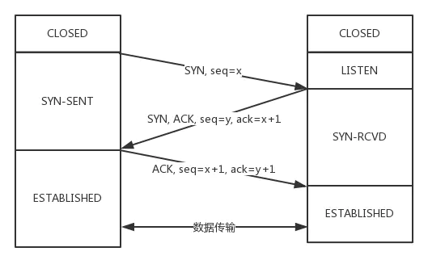
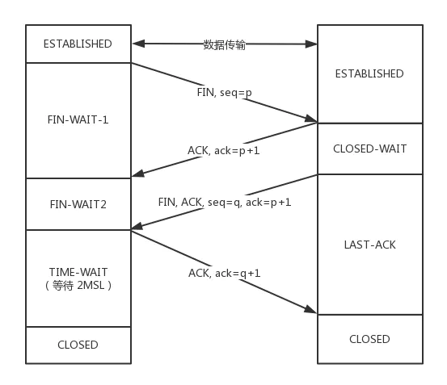

## 网络底层基础

### TCP 和 UDP

TCP 是一个面向连接的、可靠的、基于字节流的传输层协议。

而 UDP 是一个面向无连接的传输层协议。(就这么简单，其它 TCP 的特性也就没有了)。

具体来分析，和 UDP 相比，TCP 有三大核心特性:

1. 面向连接。所谓的连接，指的是客户端和服务器的连接，在双方互相通信之前，TCP 需要三次握手建立连接，而 UDP 没有相应建立连接的过程。

2. 可靠性。TCP 花了非常多的功夫保证连接的可靠，这个可靠性体现在哪些方面呢？一个是有状态，另一个是可控制。

   TCP 会精准记录哪些数据发送了，哪些数据被对方接收了，哪些没有被接收到，而且保证数据包按序到达，不允许半点差错。这是有状态。
   当意识到丢包了或者网络环境不佳，TCP 会根据具体情况调整自己的行为，控制自己的发送速度或者重发。这是可控制。
   相应的，UDP 就是无状态, 不可控的。

3. 面向字节流。UDP 的数据传输是基于数据报的，这是因为仅仅只是继承了 IP 层的特性，而 TCP 为了维护状态，将一个个 IP 包变成了字节流。

### TCP 的三次握手

**TCP** 的三次握手，也是需要确认双方的两样能力: **发送的能力和接收的能力**。于是便会有下面的三次握手的过程:

从最开始双方都处于 **CLOSED** 状态。然后服务端开始监听某个端口，进入了 **LISTEN** 状态。

然后客户端主动发起连接，发送 **SYN** , 自己变成了 **SYN-SENT** 状态。

服务端接收到，返回 **SYN** 和 **ACK**(对应客户端发来的 **SYN**)，自己变成了 **SYN-REVD**。

之后客户端再发送 **ACK** 给服务端，自己变成了 **ESTABLISHED** 状态；服务端收到 **ACK** 之后，也变成了 **ESTABLISHED** 状态。

另外需要提醒你注意的是，从图中可以看出，**SYN** 是需要消耗一个序列号的，下次发送对应的

**ACK** 序列号要加 1，为什么呢？只需要记住一个规则:

凡是需要对端确认的，一定消耗 **TCP** 报文的序列号。

**SYN** 需要对端的确认， 而 **ACK** 并不需要，因此 **SYN** 消耗一个序列号而 **ACK** 不需要。

### TCP 的四次挥手

发送后客户端变成了 **FIN-WAIT-1** 状态。注意, 这时候客户端同时也变成了 **half-close(半关闭)** 状态，即无法向服务端发送报文，只能接收。

服务端接收后向客户端确认，变成了 **CLOSED-WAIT** 状态。

客户端接收到了服务端的确认，变成了 **FIN-WAIT2** 状态。

随后，服务端向客户端发送 **FIN**，自己进入 **LAST-ACK** 状态，

客户端收到服务端发来的 **FIN** 后，自己变成了 TIME-WAIT 状态，然后发送 ACK 给服务端。

注意了，这个时候，客户端需要等待足够长的时间，具体来说，是 2 个 **MSL(Maximum Segment Lifetime，报文最大生存时间)**, 在这段时间内如果客户端没有收到服务端的重发请求，那么表示 ACK 成功到达，挥手结束，否则客户端重发 **ACK**。
