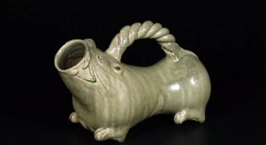

# 生活一题[（每日一题）](./README.md)

在这里记录着每天自己遇到的一道印象深刻的前端问题，以及一道生活中随处可见的小问题。

强迫自己形成积累的习惯，鞭挞自己不断前行，共同学习。

### **2019/03/27 - 2019/03/31**

- “马桶”的由来是什么？

坐便器，俗称马桶，是每个家庭不可缺少的一部分。当我们每天与马桶亲密接触的时候，有没有想过，坐便器为什么叫“马桶”？和马有什么直接的关系吗？

早时古人没有便器，只有蹲坑，很容易发生惨剧。后来受汉高祖刘邦“以儒生之冠当溺器”的启发，才有了后来伟大的发明——“虎子”，是当时的便器。“虎子”口部饰虎首，背有扁平提梁，下有四足，操作方便。

到了唐朝之后，唐高祖李渊的爷爷李虎，为了避其名讳，改名“马子”。当然这东西刚开始发明的时候是用于男性小便的，随着慢慢发展，由石器玉器转化成木制的桶（也方便女性使用），因此“马子”也改名称为“马桶”!
