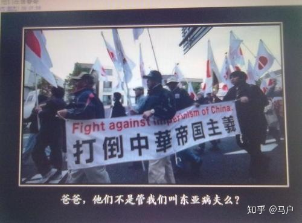

### **2019/05/06 - 2019/05/12** :watch:

---

- [显示器的 VGA、HDMI、DVI 和 DisplayPort 接口有什么区别？](https://www.zhihu.com/question/19571221)

- “覆巢之下，岂有完卵”是什么意思？怎样解释

  

  
点击

  “覆巢之下，岂有完卵”比喻整体遭殃，个体（或部分）也不能保全。也有面对必然要发生的事情，要从容地面对它。不能乱了阵脚的意思。

  

- 为什么称印度人为“印度啊三”？

  

  
点击

  印度阿三，指印度人，带有种族歧视意味的贬义称呼，阿 SIR 音译。“印度阿三”来自“十里洋场”时期的吴语上海话，吴人极喜加“阿”字，而上海话中与“三”相关的词汇（阿三、八三、瘪三、十三点、猪头三）多为贬义词。上海当年的英租界中经常会有从印度调来的“公务员”，负责一些杂事，而这些印度人是英国人的忠实“爪牙”，整天警棍乱舞，因此上海人便蔑称其为“阿三”。而今，“印度阿三”一词已经广泛流传开来，多含国人嘲弄印度之意。

  

- 为什么黄瓜不是黄色而是绿色？

  

  
点击

  黄瓜最早叫做胡瓜，是汉朝张骞出使西域的时候带回来的，胡瓜之所以改名为黄瓜，始于后赵，因为后赵这个王朝的建立者是石勒，他是羯族人，当他在襄国（今河北邢台）当上皇帝后，经常听到自己国家的人喊羯族为胡人，于是大为恼怒，还制定了一条法律：任何地方都不允许出现“胡”字，否则力斩不赦。有一天石勒召见官员的时候，官员对着胡瓜说道：这黄瓜不错。于是黄瓜的叫法慢慢也就传开了。

  

- “天要下雨，娘要嫁人” 的典故？

    

    
点击

  古有书生朱耀宗，天资聪慧，满腹经纶，进京赶考高中状元。皇上殿试见他不仅才华横溢，而且一表人才， 便将他招为驸马。“春风得意马蹄疾”，循惯例朱耀宗一身锦绣新贵还乡。临行前，朱耀宗奏明皇上，提起他的母亲如何含辛茹苦，如何从小将他培养成人，母子俩如何相依为命，请求皇上为他多年守寡一直不嫁的母亲树立贞节牌坊。皇上闻言甚喜，心中更加喜爱此乘龙快婿，准允所奏。朱耀宗喜滋滋地日夜兼程，回家拜见母亲。

  岂料母亲早与老师约定，待到耀宗高中归来成家立业后正式结婚，白首偕老。殊不料，这桩姻缘却要被毫不知情的朱耀宗无意中搅黄了，出现了这样尴尬的局面。

  解铃还须系铃人。正值左右为难之际，朱母不由长叹一声：“那就听天由命吧。”她说着随手解下身上一件罗裙，告诉朱耀宗说：“明天你替我把裙子洗干净，一天一夜晒干，如果裙子晒干，我便答应不改嫁；如果裙子不干，天意如此，你也就不用再阻拦了。”

  这一天晴空朗日，朱耀宗心想这事并不难做。便点头同意。谁知当夜阴云密布，天明下起暴雨，裙子始终是湿漉漉的，朱耀宗心中叫苦不迭，知是天意。
  陈秀英则认认真真地对儿子说：“孩子，天要下雨，娘要嫁人，天意不可违！”

    

### **2019/04/29 - 2019/05/05** :watch:

- 高空中飞行的飞机需要制氧吗？

  

  
点击

  分两部分回答：

  1. 客舱内

  客机在高空不需要单独补充氧气。高空大气氧气仍然占大气 20%左右，只是压强低，大气密度低所以呼吸困难。不需要分离氧气，直接把舱外空气抽进机舱，舱内压力增加到与地面相近，最多和爬黄山差不多，人就能正常呼吸了。

  2. 发动机

  因为高空氧气稀薄，所以飞机需要压比很高的风扇、压气机将稀薄的空气压缩成高压的空气输送到燃烧室中。先进民用航空发动机的压气机的总压比能够达到 40+，也就是能将一个大气压的空气压缩成四十个大气压的空气并送入燃烧室，这样即使在万米高空，燃烧室所需的氧气也是充足的。重要的是，如何让进入燃烧室的高压空气充分地、高效地燃烧。如果燃烧不充分，燃烧效率低，就会严重影响发动机的性能。

  </detail>

* 什么是鸣金收兵？

* 为何身份证最后一位有 X?

* 什么是空竹？

* 飞机的起源？

* 空姐一天要工作多少个航班？

  

  
点击

  **来自百度知道上的回答：**

      一班是半天制.做一休2的，最忙的就是乘务长和头等的人了，他们一般是做 6 休 1，具体时间是看航班的长短

      一个来回的北京是3.9小时，这是空中的飞行时间，一般我飞一个北京一共用 10 小时

      我家坐公车到机场是 2 小时，开准备会，25 分钟，然后坐车去机场，我们一般是提前 1 小时到飞机上，然后检查设备，摆放用品，清点餐食之类的用半小时，然后用半小时的时间上客，然后关门，估计关门后 15 分钟起飞（除特殊情况，如流量控制），然后是北京是去程 1.40 分，在地面休息吃饭加上客用 1 小时，然后关门起飞，落地了就能回家

  </detail>

* 什么时候让你感觉中国强大起来了？

  

  
点击

  
  </detail>
